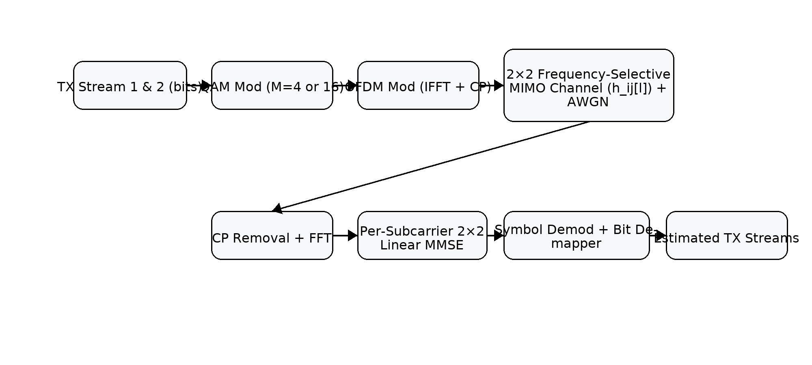
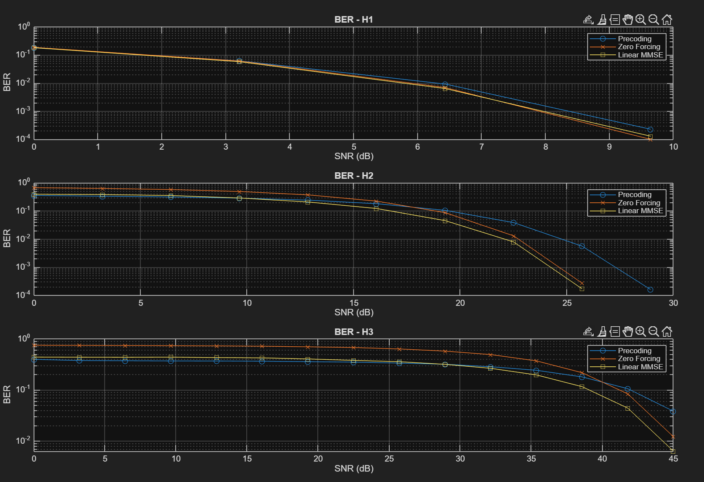
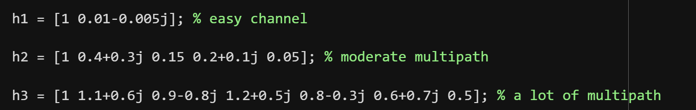
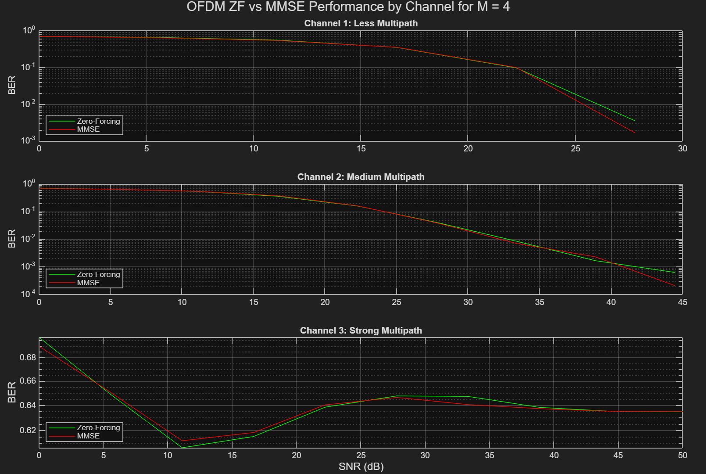
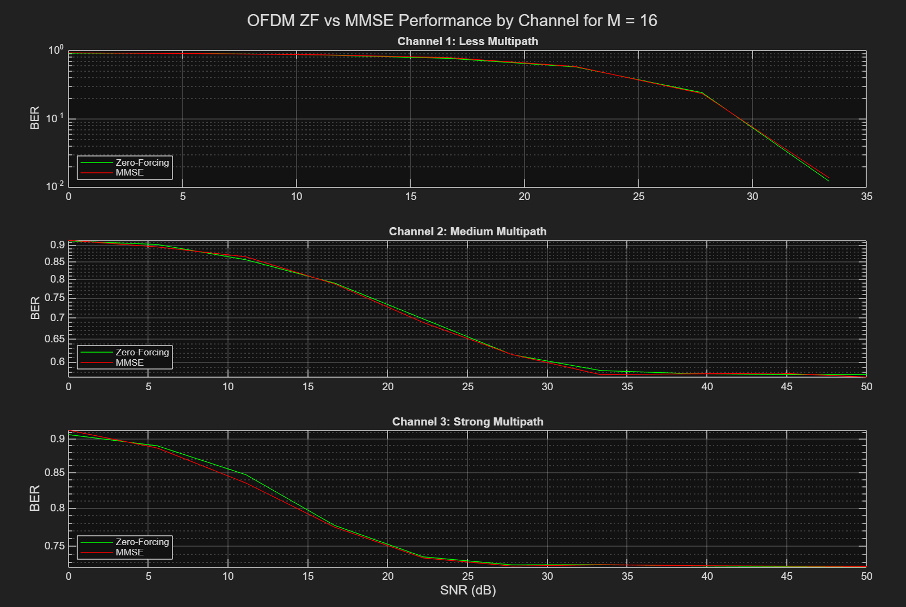

# MIMO-OFDM

This repository contains MATLAB simulations and results for:

1. **OFDM (SISO)**: ZF vs. MMSE equalization over frequency-selective channels
2. **Flat 2×2 MIMO**: Precoding (SVD), ZF, Linear-MMSE
3. **2×2 MIMO-OFDM**: Per-subcarrier Linear-MMSE

## System Overview

A high-level block diagram of the combined MIMO-OFDM system

## Part 1 — OFDM (SISO) with ZF vs. MMSE

### 802.11a OFDM Parameters

* $N_\text{FFT}=64$, $N_\text{CP}=16$
* $N_\text{DATA}=48$, $N_\text{PILOT}=4$ at indices $[7,21,43,57]$ with pattern $[1,1,1,-1]$
* Nulls at $[27{:}37, 64]$
* Data indices: $[2{:}6, 8{:}20, 22{:}26, 38{:}42, 44{:}56, 58{:}63, 1]$

### Equalizer Equations

* **Zero-Forcing (ZF):**

$$
\hat{X}_\text{ZF}[k] = \frac{Y[k]}{H[k]}
$$

* **Minimum Mean Square Error (MMSE):**

$$
\hat{X}_\text{MMSE}[k] = \frac{H^*[k]}{|H[k]|^2 + N_0} \, Y[k]
$$

### Channels Used

* $h_1 = [1, 0.01 - 0.005j]$
* $h_2 = [1, 0.4+0.3j, 0.15, 0.2+0.1j, 0.05]$
* $h_3 = [1, 1.1+0.6j, 0.9-0.8j, 1.2+0.5j, 0.8-0.3j, 0.6+0.7j, 0.5]$

### Results

**OFDM BER curves (ZF vs. MMSE across multipath channels):**

## Part 2 — Flat 2×2 MIMO (Precoding, ZF, LMMSE)

### Channels Used

$$
\mathbf H_1 =
\begin{bmatrix}
1 & 0.14-0.69j \\
-0.92+0.17j & 0.52-1j
\end{bmatrix}, \quad
\mathbf H_2 =
\begin{bmatrix}
0.5+1.2j & 1.1+0.6j \\
0.9-0.8j & 0.4-1.3j
\end{bmatrix}, \quad
\mathbf H_3 =
\begin{bmatrix}
1 & 0.99+0.01j \\
0.99-0.01j & 1
\end{bmatrix}
$$

### Equalizer / Precoding Equations

* **Zero Forcing (ZF):**

$$
\hat{\mathbf{x}}_\text{ZF} = (\mathbf H^\mathrm{H}\mathbf H)^{-1}\mathbf H^\mathrm{H}\mathbf y
$$

* **Linear MMSE:**

$$
\hat{\mathbf{x}}_\text{LMMSE} = (\mathbf H^\mathrm{H}\mathbf H + N_0 \mathbf I)^{-1}\mathbf H^\mathrm{H}\mathbf y
$$

* **SVD Precoding (Channel Diagonalization):**

$$
\mathbf H = \mathbf U \mathbf \Sigma \mathbf V^\mathrm{H}
$$

**Transmit precoding:**

$$
\mathbf x = \mathbf V \tilde{\mathbf x}
$$

**Receive combining:**

$$
\tilde{\mathbf y} = \mathbf U^\mathrm{H} \mathbf y
= \mathbf U^\mathrm{H} \mathbf H \mathbf V \tilde{\mathbf x} + \mathbf U^\mathrm{H} \mathbf w
= \mathbf \Sigma \tilde{\mathbf x} + \tilde{\mathbf w}
$$

**Result:**
The MIMO channel is diagonalized into independent parallel SISO channels:

$$
\tilde{y}_i = \sigma_i \tilde{x}_i + \tilde{w}_i
$$

where $\sigma_i$ are the singular values of $\mathbf H$.

### Results

**BER across equalizers and channels:**

**Throughput across equalizers and channels:**

## Part 3 — 2×2 MIMO-OFDM (Per-Subcarrier LMMSE)

Each TX antenna generates a separate OFDM stream; RX antennas capture the convolved signals, then OFDM demodulation and per-subcarrier MIMO equalization is applied.

### Channel Matrices (Impulse Responses)

**Mild multipath:**

$$
\mathbf H_{\text{mild}} =
\begin{bmatrix}
[1, 0.2j, 0.05-0.01j] & [0.8, 0.15j, 0.04-0.01j] \\
[0.7, 0.1j, 0.03-0.02j] & [0.9, 0.25j, 0.06-0.01j]
\end{bmatrix}
$$

**Moderate multipath:**

$$
\mathbf H_{\text{moderate}} =
\begin{bmatrix}
[1, 0.5+0.5j, 0.2, 1, 0.4] & [0.8, 0.4+0.3j, 0.1, 0.7, 0.2] \\
[0.7, 0.3+0.4j, 0.15, 0.8, 0.3] & [0.9, 0.6+0.2j, 0.25, 0.9, 0.35]
\end{bmatrix}
$$

**Severe multipath:**

$$
\mathbf H_{\text{severe}} =
\begin{bmatrix}
[1, 0.9+0.3j, 0.7-0.2j, 0.5+0.1j] & [0.8, 0.8+0.4j, 0.6-0.1j, 0.4+0.2j] \\
[0.7, 0.7+0.5j, 0.5-0.3j, 0.3+0.3j] & [0.9, 0.8+0.2j, 0.6-0.4j, 0.5+0.1j]
\end{bmatrix}
$$

### Per-Subcarrier Equalizer

$$
\hat{\mathbf X}[k] = \big(\mathbf H[k]^\mathrm{H} \mathbf H[k] + N_0 \mathbf I\big)^{-1} \mathbf H[k]^\mathrm{H} \mathbf Y[k]
$$

### Results

**BER of 2×2 MIMO-OFDM with MMSE:**

**Throughput vs. SNR (20 MHz sampling rate):**

---

## Key Insights

* SVD-based precoding diagonalizes the channel into parallel subchannels, but noise scaling matters.
* OFDM combats multipath, but high-order QAM in severe channels produces high BER.
* Combining MIMO + OFDM with MMSE equalization yields robust BER and throughput performance.

✅ This version is **GitHub-ready**: equations render, figures flow in the correct order, channels are matrices, SVD is clean.

Do you also want me to **rename the figure files** (`report_img_pX_Y.png`) into human-readable names like `ofdm_ber.png`, `mimo_throughput.png`, etc., so the README looks polished?
