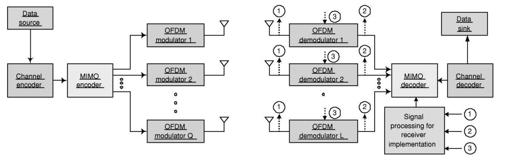

# Wireless Engineering Project 5 — MIMO / OFDM Equalization

This repository contains MATLAB simulations and results for:

1. **Flat 2×2 MIMO**: Precoding (SVD), ZF, Linear-MMSE
2. **OFDM (SISO)**: ZF vs. MMSE over frequency-selective channels
3. **2×2 MIMO-OFDM**: Per-subcarrier Linear-MMSE

## System Overview

(Added for the README) a high-level block diagram of the combined MIMO-OFDM chain:

## Part 1 — Flat 2×2 MIMO (Precoding, ZF, LMMSE)

### Channels Used

$$
\mathbf H_1 =
\begin{bmatrix}
1 & 0.14-0.69j \\
-0.92+0.17j & 0.52-1j
\end{bmatrix},\quad
\mathbf H_2 =
\begin{bmatrix}
0.5+1.2j & 1.1+0.6j \\
0.9-0.8j & 0.4-1.3j
\end{bmatrix},\quad
\mathbf H_3 =
\begin{bmatrix}
1 & 0.99+0.01j \\
0.99-0.01j & 1
\end{bmatrix}
$$

### Equalizer / Precoding Equations

**Zero Forcing (ZF):**

$$
\hat{\mathbf{x}}_\text{ZF} = (\mathbf H^\mathrm{H}\mathbf H)^{-1}\mathbf H^\mathrm{H}\mathbf y
$$

**Linear MMSE:**

$$
\hat{\mathbf{x}}_\text{LMMSE} = (\mathbf H^\mathrm{H}\mathbf H + N_0 \mathbf I)^{-1}\mathbf H^\mathrm{H}\mathbf y
$$

**SVD Precoding (Channel Diagonalization):**

$$
\mathbf H = \mathbf U \mathbf \Sigma \mathbf V^\mathrm{H}
$$

**TX precoding:** $\mathbf x = \mathbf V \tilde{\mathbf x}$
**RX combining:** $\tilde{\mathbf y} = \mathbf U^\mathrm{H} \mathbf y = \mathbf \Sigma \tilde{\mathbf x} + \tilde{\mathbf w}$
**Parallel subchannels:** $\tilde{y}_i = \sigma_i \tilde{x}_i + \tilde{w}_i$

### Results (from report)

**BER across equalizers/channels:**

**Throughput across equalizers/channels:**

## Part 2 — OFDM (SISO) with ZF vs. MMSE

### 802.11a OFDM Parameters

* $N_\text{FFT}=64$, $N_\text{CP}=16$
* $N_\text{DATA}=48$, $N_\text{PILOT}=4$ at $[7,21,43,57]$ with $[1,1,1,-1]$
* Nulls at $[27{:}37, 64]$
* Data indices: $[2{:}6, 8{:}20, 22{:}26, 38{:}42, 44{:}56, 58{:}63, 1]$

### Equalizer Equations (per subcarrier $k$)

**ZF:**

$$
\hat{X}_\text{ZF}[k] = \frac{Y[k]}{H[k]}
$$

**MMSE:**

$$
\hat{X}_\text{MMSE}[k] = \frac{H^*[k]}{|H[k]|^2 + N_0}\,Y[k]
$$

### SISO Channels Used

* $h_1 = [1,\ 0.01-0.005j]$
* $h_2 = [1,\ 0.4+0.3j,\ 0.15,\ 0.2+0.1j,\ 0.05]$
* $h_3 = [1,\ 1.1+0.6j,\ 0.9-0.8j,\ 1.2+0.5j,\ 0.8-0.3j,\ 0.6+0.7j,\ 0.5]$

### Results (from report)

**OFDM BER curves (ZF vs. MMSE across multipath):**

## Part 3 — 2×2 MIMO-OFDM (Per-Subcarrier LMMSE)

Each TX sends its own OFDM stream; RX removes CP, FFTs, then performs **2×2 LMMSE per subcarrier**.

### Frequency-Selective Channel Matrices (impulse response vectors as entries)

**Mild:**

$$
\mathbf H_{\text{mild}} =
\begin{bmatrix}
[1, 0.2j, 0.05-0.01j] & [0.8, 0.15j, 0.04-0.01j] \\
[0.7, 0.1j, 0.03-0.02j] & [0.9, 0.25j, 0.06-0.01j]
\end{bmatrix}
$$

**Moderate:**

$$
\mathbf H_{\text{moderate}} =
\begin{bmatrix}
[1, 0.5+0.5j, 0.2, 1, 0.4] & [0.8, 0.4+0.3j, 0.1, 0.7, 0.2] \\
[0.7, 0.3+0.4j, 0.15, 0.8, 0.3] & [0.9, 0.6+0.2j, 0.25, 0.9, 0.35]
\end{bmatrix}
$$

**Severe:**

$$
\mathbf H_{\text{severe}} =
\begin{bmatrix}
[1, 0.9+0.3j, 0.7-0.2j, 0.5+0.1j] & [0.8, 0.8+0.4j, 0.6-0.1j, 0.4+0.2j] \\
[0.7, 0.7+0.5j, 0.5-0.3j, 0.3+0.3j] & [0.9, 0.8+0.2j, 0.6-0.4j, 0.5+0.1j]
\end{bmatrix}
$$

### Per-Subcarrier Equalizer

$$
\hat{\mathbf X}[k] = \big(\mathbf H[k]^\mathrm{H} \mathbf H[k] + N_0 \mathbf I\big)^{-1} \mathbf H[k]^\mathrm{H} \mathbf Y[k]
$$

### Results (from report)

**BER — 2×2 MIMO-OFDM:**

**Throughput — 2×2 MIMO-OFDM (20 MHz):**

If any figure filenames differ in your repo, tell me the actual names and I’ll remap them—but the **order and sections above** now match your report: **Part 1=MIMO**, **Part 2=OFDM**, **Part 3=MIMO-OFDM**.
