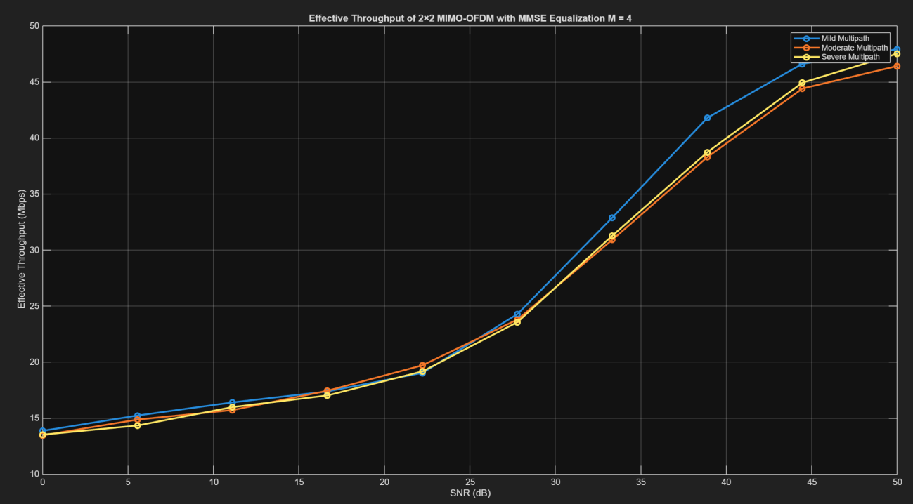

# MIMO-OFDM

This repo consolidates three parts of a wireless link study:

1. **SISO-OFDM equalization** (ZF vs. MMSE) over multipath channels
2. **Flat 2×2 MIMO** (Precoding, ZF, LMMSE)
3. **2×2 MIMO-OFDM** (per-subcarrier LMMSE)

## System Diagram

A high-level block diagram of the combined MIMO-OFDM system (added here — not in the report):

## Part 1: OFDM (SISO) with ZF vs. MMSE

We implement 802.11a-style OFDM framing and compare Zero-Forcing and Linear-MMSE equalizers on frequency-selective channels. Perfect CSIR is assumed.

### 802.11a OFDM Parameters

* FFT size: $N_\text{FFT} = 64$
* Cyclic prefix: $N_\text{CP} = 16$ (1/4)
* Data subcarriers: $N_\text{DATA} = 48$
* Pilots: $N_\text{PILOT} = 4$ at indices $[7, 21, 43, 57]$ with BPSK pattern $[1, 1, 1, -1]$
* Null subcarriers: $N_\text{NULL} = 12$ at $[27{:}37, 64]$
* Data indices: $[2{:}6, 8{:}20, 22{:}26, 38{:}42, 44{:}56, 58{:}63, 1]$

### Equalizer Equations (SISO-OFDM)

* **Zero-Forcing (ZF):**

$$
\hat{X}_\text{ZF}[k] = \frac{Y[k]}{H[k]}
$$

* **Minimum Mean Square Error (MMSE):**

$$
\hat{X}_\text{MMSE}[k] = \frac{H^*[k]}{|H[k]|^2 + N_0} \, Y[k]
$$

### Channels Used

* $h_1 = [1, \; 0.01 - 0.005j]$
* $h_2 = [1, \; 0.4+0.3j, \; 0.15, \; 0.2+0.1j, \; 0.05]$
* $h_3 = [1, \; 1.1+0.6j, \; 0.9-0.8j, \; 1.2+0.5j, \; 0.8-0.3j, \; 0.6+0.7j, \; 0.5]$

### Results

**BER vs SNR across channels (ZF vs MMSE):**

## Part 2: Flat 2×2 MIMO (Precoding, ZF, LMMSE)

We evaluate three linear strategies on flat channels with varying correlation.

### Channels Used

* $\mathbf H_1 = \begin{bmatrix} 1 & 0.14-0.69j \\ -0.92+0.17j & 0.52-1j \end{bmatrix}$
* $\mathbf H_2 = \begin{bmatrix} 0.5+1.2j & 1.1+0.6j \\ 0.9-0.8j & 0.4-1.3j \end{bmatrix}$
* $\mathbf H_3 = \begin{bmatrix} 1 & 0.99+0.01j \\ 0.99-0.01j & 1 \end{bmatrix}$

### Equalizer Equations (Flat MIMO)

* **Zero Forcing (ZF):**

$$
\hat{\mathbf{x}}_\text{ZF} = (\mathbf H^\mathrm{H}\mathbf H)^{-1}\mathbf H^\mathrm{H}\mathbf y
$$

* **Linear MMSE:**

$$
\hat{\mathbf{x}}_\text{LMMSE} = (\mathbf H^\mathrm{H}\mathbf H + N_0 \mathbf I)^{-1}\mathbf H^\mathrm{H}\mathbf y
$$

* **SVD Precoding (Channel Diagonalization):**

$$
\mathbf H = \mathbf U \mathbf \Sigma \mathbf V^\mathrm{H}
$$

**Transmit precoding:**

$$
\mathbf x = \mathbf V \tilde{\mathbf x}
$$

**Receive combining:**

$$
\tilde{\mathbf y} = \mathbf U^\mathrm{H} \mathbf y
= \mathbf U^\mathrm{H} \mathbf H \mathbf V \tilde{\mathbf x} + \mathbf U^\mathrm{H} \mathbf w
= \mathbf \Sigma \tilde{\mathbf x} + \tilde{\mathbf w}
$$

**Result:** the MIMO channel is diagonalized into **independent parallel SISO channels**:

$$
\tilde{y}_i = \sigma_i \tilde{x}_i + \tilde{w}_i
$$

where $\sigma_i$ are the singular values of $\mathbf H$.

### Results

**BER performance across channels:**

**Throughput performance:**

## Part 3: 2×2 MIMO-OFDM with LMMSE

OFDM handles delay spread; a per-subcarrier 2×2 LMMSE equalizer handles spatial mixing.

### Channels Used

* **Mild multipath:**
  $h_{11} = [1, 0.2j, 0.05-0.01j]$,
  $h_{12} = [0.8, 0.15j, 0.04-0.01j]$,
  $h_{21} = [0.7, 0.1j, 0.03-0.02j]$,
  $h_{22} = [0.9, 0.25j, 0.06-0.01j]$

* **Moderate multipath:**
  $h_{11} = [1, 0.5+0.5j, 0.2, 1, 0.4]$,
  $h_{12} = [0.8, 0.4+0.3j, 0.1, 0.7, 0.2]$,
  $h_{21} = [0.7, 0.3+0.4j, 0.15, 0.8, 0.3]$,
  $h_{22} = [0.9, 0.6+0.2j, 0.25, 0.9, 0.35]$

* **Severe multipath:**
  $h_{11} = [1, 0.9+0.3j, 0.7-0.2j, 0.5+0.1j]$,
  $h_{12} = [0.8, 0.8+0.4j, 0.6-0.1j, 0.4+0.2j]$,
  $h_{21} = [0.7, 0.7+0.5j, 0.5-0.3j, 0.3+0.3j]$,
  $h_{22} = [0.9, 0.8+0.2j, 0.6-0.4j, 0.5+0.1j]$

### Equalizer Equation (Per Subcarrier)

* **MMSE:**

$$
\hat{\mathbf X}[k] = \big(\mathbf H[k]^\mathrm{H} \mathbf H[k] + N_0 \mathbf I\big)^{-1} \mathbf H[k]^\mathrm{H} \mathbf Y[k]
$$

### Results

**BER performance:**

**Effective throughput:**

## Reproducing Results

* MATLAB R2022b+ recommended
* Run each part’s script to produce BER/throughput figures
* Requires Communications Toolbox (`qammod`/`qamdemod`)

## Notes

* Pilot pattern for 802.11a: `[1, 1, 1, -1]`
* For flat MIMO, ZF may severely amplify noise when $\mathbf H$ is ill-conditioned; LMMSE mitigates this via the $N_0 \mathbf I$ term
* In the SVD precoding pipeline, scaling by $\mathbf \Sigma^{-1}$ equalizes stream SNRs but may increase noise
